# multinational-retail-data-centralisation
## Description
The project involves the collection, cleaning, and centralisation of data from various sources into a local Postgres database. The data is collected from multiple sources including Amazon S3 buckets, Amazon RDS databases, and Amazon API endpoints. The collected data is then cleaned and processed using the Pandas library in Python. Finally, the cleaned data is saved to local Postgres database which can be used for querying.

The primary goal of the project is to create a single source of truth for data, which can be easily accessed and analyzed. This centralised data system improves the efficiency of data retrieval and analysis.

The data is stored in the following tables in the local Postgres database named `sales_data`.
* `dim_card_details`: card details.
* `dim_products`: product details.
* `dim_users`: users details.
* `dim_store_details`: store details.
* `orders_table`: orders details, fact table.
* `dim_date_times`: date and time details.

## Project Overview Diagram
The following diagram provides an overview of the data collection, cleaning, and storage process.



## Local Database ER Diagram
The following diagram is an Entity-Relationship Diagram for the final `sales_data` local Postgres database.


## Table of Contents
1. [Getting Started](#getting-started)
    - [Cloning the project](#cloning-the-project)
    - [Setting up the environment](#setting-up-the-environment)
    - [Installing requirements](#installing-requirements)
    - [Setting up local Postgres database](#setting-up-local-postgres-database)
    - [Retrieving, cleaning and saving data](#retrieving-cleaning-and-saving-data)
2. [Running Queries](#running-queries)

## Getting Started
### Cloning the project
The project can be cloned with:
```bash
git clone https://github.com/prg48/multinational-retail-data-centralisation.git
```

### Setting up the environment
The environment can be setup for the project either using [conda](https://docs.conda.io/projects/conda/en/latest/user-guide/tasks/manage-environments.html#creating-an-environment-with-commands) or [virtualenv](https://virtualenv.pypa.io/en/latest/user_guide.html).

### Installing requirements
The requirements for the project can be installed with:
```bash
pip install -r requirements.txt
```

### Setting up local Postgres database
PostgreSQL is required to run the project. please follow [this link](https://www.postgresql.org/download/) if you don't have PostgreSQL installed in your local system.

A `sales_data` database must be created in the local PostgreSQL. please follow [this link](https://www.postgresql.org/docs/current/sql-createdatabase.html) or [this link](https://www.tutorialsteacher.com/postgresql/create-database) if using pgadmin4 or psql to create a new database.

A local database credentials file is required for the project to connect to the newly created `sales_data` database to store the cleaned data after retrieval. The local database credentials must be stored in `config/local_db_creds.yaml` with the following information. Please make sure the information is correct or else the project won't be able to connect to the local database to save the cleaned data.

* `DATABASE_TYPE`: postgresql
* `DB_API`: psycopg2
* `HOST`: localhost
* `USER`: [please enter the username for the database for this field. by default it is `postgres`.]
* `PASSWORD`: [please enter the password setup for the local database for this field.]
* `PORT`: 5432
* `DATABASE`: sales_data

### Retrieving, cleaning and saving data
The data can be retrieved, cleaned and saved in the local database with:
```bash
python main.py
```

OR

```bash
python3 main.py
```
if using python v3.x. 

## Running Queries
Following are some examples of queries run on the local database. Please refer to the [local database ER diagram](#local-database-er-diagram) to get an overview of the tables' relationships.

* `Determining what type of store is generating the most sales in germany`

```sql
WITH ops AS (
    SELECT o.store_code AS store_code,
        o.product_code AS product_code,
        o.product_quantity AS product_quantity,
        p.product_price AS product_price,
        s.store_type AS store_type,
        s.country_code AS country_code,
        o.product_quantity * p.product_price AS sales
    FROM orders_table AS o
    JOIN dim_products AS p ON o.product_code = p.product_code
    JOIN dim_store_details AS s ON o.store_code = s.store_code
    WHERE s.country_code = 'DE'
)

SELECT SUM(sales) AS total_sales, store_type, country_code
FROM ops
GROUP BY store_type, country_code
```

results:

| total_sales | store_type  | country_code |
|-------------|-------------|--------------|
| 198373.57   | Outlet      | DE           |
| 247634.20   | Mall Kiosk  | DE           |
| 384625.03   | Super Store | DE           |
| 1109909.59  | Local       | DE           |

* `The staff numbers in each of the countries the company sells in.`

```sql
SELECT SUM(stafF_numbers) as total_staff_numbers, country_code
FROM dim_store_details
GROUP BY country_code
```

results:

| total_staff_numbers | country_code |
|---------------------|--------------|
| 13307               | GB           |
| 6123                | DE           |
| 1384                | US           |

Please feel free to run and test as many queries as you like. Thank you for your interest in the project.